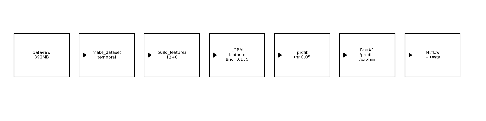
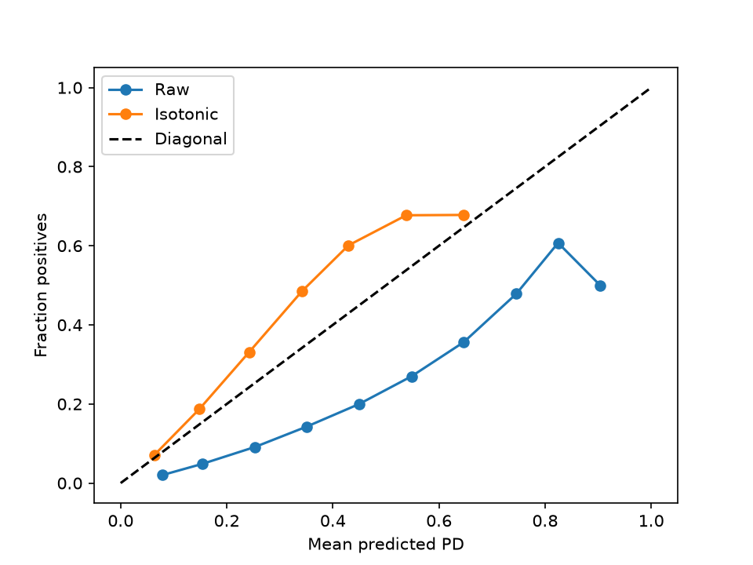
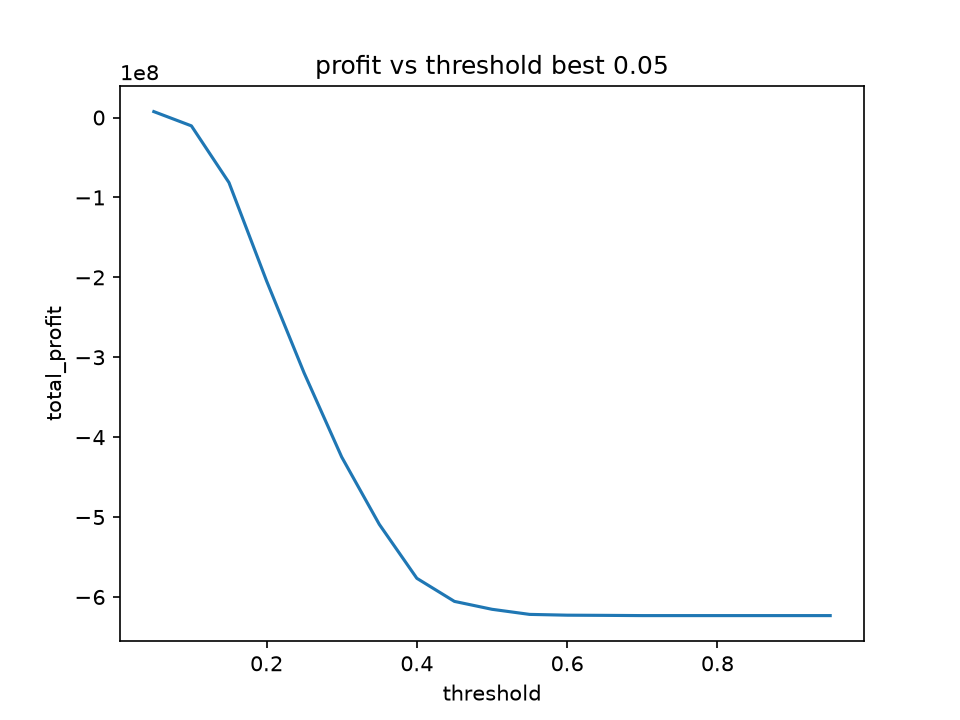
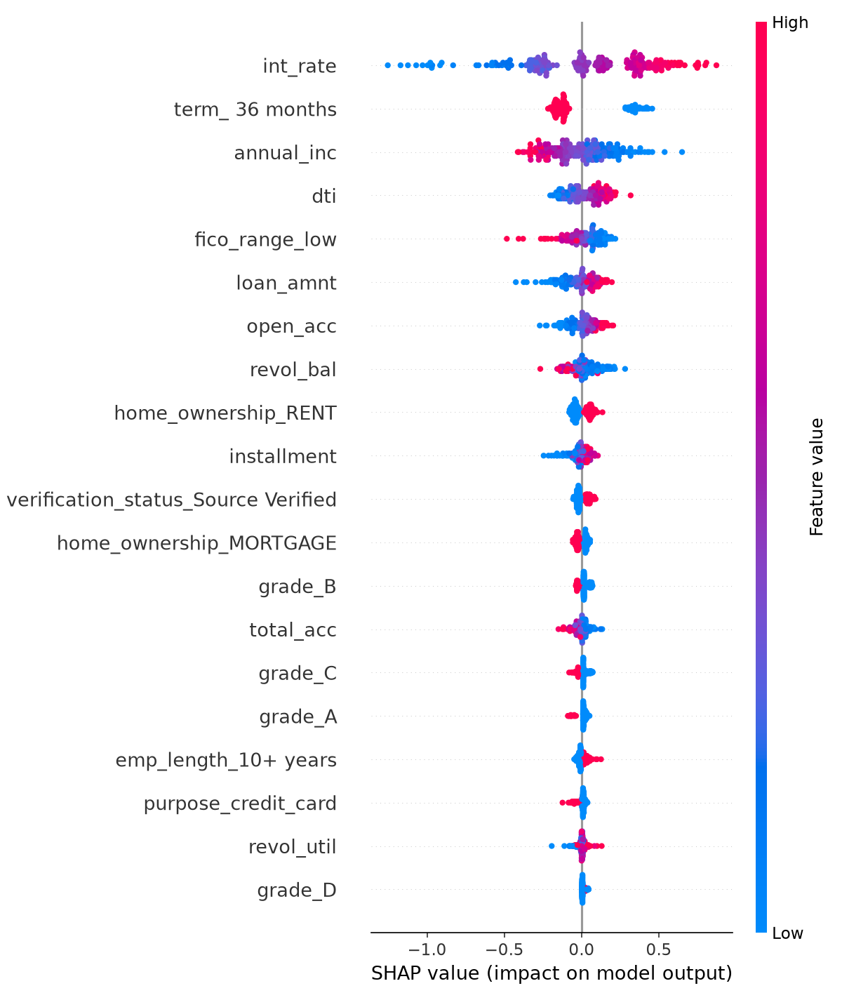

# loan-default-risk -- PD + Profit + SHAP + A/B

[](https://github.com/WHITEJACK5/loan-default-risk/actions)
[](pyproject.toml)
[](LICENSE)
[](https://whitejack5-loan-default-risk.hf.space)

Batch tabular risk system that predicts probability of default (PD) for LendingClub loans and converts it into a profit-based approve/reject policy with adverse-action explanations and A/B experimentation.

**Live Demo:** [whitejack5-loan-default-risk.hf.space](https://whitejack5-loan-default-risk.hf.space) -- Gradio ZeroGPU -- **GitHub:** [WHITEJACK5/loan-default-risk](https://github.com/WHITEJACK5/loan-default-risk) -- **Tag:** `v2.0.0`

## 🎯 Problem & Scale

2.26M raw LendingClub 2007-18Q4 -> 1.34M after `Fully Paid/Charged Off` filter (drop `Current/Late`). 151 cols -> 24 origination-time cols via `docs/leakage_audit.md`. Temporal split `train <=2014 451,059 17.0%` / `val 2015-16 668,640 21.5%` / `test >=2017 225,611 21.3%` -- no random split. Validation `bad_loan 0, bad_target 0`.

## 🏗️ Architecture



`data/raw/392MB` -> `src/data/make_dataset.py` -> `src/features/build_features.py` -> `src/loan_default_risk/modeling.py` (single `build_model` `LGBM B`) -> `src/models/calibrate.py` (isotonic) -> `src/policy/evaluate_profit.py` (cash table) -> `src/api/main.py` (`/predict /explain /experiment/assign`) -> `src/monitoring/drift.py` -> `Docker + MLflow`

## 📊 Metrics

<!-- METRICS:START -->
| Split | n | dr | ROC | Gini | PR-AUC | Brier | KS | Recall@5% |
|-------|---|----|-----|------|--------|-------|----|-----------|
| val 2015-16 | 668,640 | 0.215 | 0.722 | 0.444 | 0.413 | 0.155 | 0.323 | 0.198 |
| test 2017-18 | 225,611 | 0.213 | 0.703 | 0.407 | 0.371 | 0.156 | 0.298 | 0.156 |
<!-- METRICS:END -->

Fairness `purpose`: `debt_consolidation 0.381 (123k), credit_card 0.325 (44k), home_improvement 0.327 (18k)` -- drift `PR -0.042 Gini -0.037` `val->test` -> quarterly retrain. See `artifacts/metrics.json` and `docs/drift_report.html`.

## 📸 Results


*Isotonic Brier 0.204->0.155 ROC 0.722*


*Best thr 0.05 profit +7.4M (legacy) / cash table approve-all -7.8B*


*Top drivers int_rate, dti, grade*


*PSI quantile, Evidently*

## 🚀 How to Run

```bash
# 1. env - bash
python -m venv .venv && source .venv/bin/activate
pip install -e ".[dev]"

# 1. env - PowerShell
python -m venv .venv; .\.venv\Scripts\Activate.ps1
pip install -e ".[dev]"

# 2. data
# download https://www.kaggle.com/datasets/wordsforthewise/lending-club -> data/raw/accepted_2007_to_2018Q4.csv.gz
python src/data/make_dataset.py
python src/data/validate.py

# 3. train + calibrate + profit
python -m src.loan_default_risk.tuning  # TimeSeriesSplit 3
python -m src.models.train
python -m src.models.calibrate
python -m src.policy.evaluate_profit

# 4. serve
uvicorn src.api.main:app --reload --port 8000  # http://127.0.0.1:8000/docs
# or docker
docker build -t ldr . && docker run -p 8000:8000 ldr
docker-compose up

# 5. test
pytest --cov=src --cov-fail-under=5
python scripts/bench2.py  # p50 110ms
```

## 💰 Cost / Latency

Train `LGBM isotonic cv5 500 trees` `3 min` on `451k` `16GB RAM` no GPU. API `p50 110.6ms p95 163.7ms p99 198.6ms` (`scripts/bench2.py` 2000 calls) on `FastAPI` `512MB` `Docker`, no GPU `$0/hr local`. `HF Gradio ZeroGPU` free `3802128` drift HTML.

## ⚠️ Limitations

- No `Home Credit` multi-table joins, single `LendingClub` only
- `LGD 0.6` fixed, `op_cost $500` heuristic, not per-grade LGD
- `no real Postgres/Redis` -- `assign.py` uses `sha256` hash
- `drift` input `PSI ok` but `PR -0.04` model drift needs quarterly retrain
- Protected attributes absent -- segment analysis is not fair-lending

## 🗺️ Roadmap

- `Postgres loan_store + Redis buckets`
- `Streamlit` `profit curve, SHAP force, cohort slicing` fully
- `MLflow registry` + `Evidently auto-retrain` on `PSI >0.2`
- `Fairness` `gender/age band` + `CUPED`
- `P2 Fraud` `1:500 PR-AUC latency 50ms Kafka Redis` next

## 📦 Structure

```
loan-default-risk/
├── src/loan_default_risk/{config,data,features,modeling,calibration}.py
├── src/{api,policy,experiments,monitoring}/
├── tests/test_*.py
├── docs/{architecture.png,calibration_curve.png,profit_curve.png,shap_summary.png,drift_report.html}
├── artifacts/metrics.json
└── dashboard/app.py
```

## 📄 License

MIT -- see `LICENSE` (DEVIREDDY BHARADWAJA REDDY 2026)
